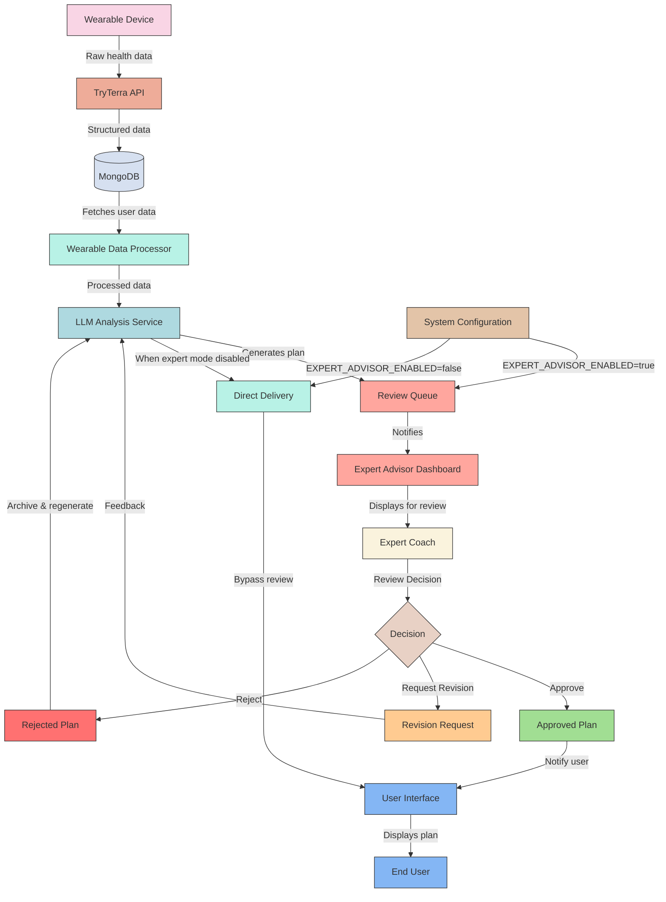

# Expert Advisor Workflow

## Visual Workflow Diagrams

### Mermaid Diagram



### Text-Based Diagram

```
┌──────────────┐                ┌─────────────┐               ┌─────────────┐
│              │  Raw Data      │             │  Structured   │             │
│   Wearable   ├───────────────►│  TryTerra   ├──────────────►│   MongoDB   │
│    Device    │                │     API     │               │  Database   │
└──────────────┘                └─────────────┘               └──────┬──────┘
                                                                     │
                                                                     │ Fetches Data
                                                                     ▼
┌──────────────┐                ┌─────────────┐               ┌──────┴──────┐
│              │                │             │               │             │
│  LLM Service │◄───────────────┤  Wearable   │◄──────────────┤ Data        │
│  (OpenAI)    │  Processed     │  Data       │               │ Processor   │
│              │  Data          │  Processor  │               │             │
└──────┬───────┘                └─────────────┘               └─────────────┘
       │
       │ Generates Plan
       ▼
┌──────────────┐
│ System Config │
│  Setting:     │
│  Expert Mode  ├───┐
└──────┬────────┘   │
       │            │
       │            │
       ▼            │               If EXPERT_ADVISOR_ENABLED = false
┌──────────────┐    │               ┌─────────────┐               ┌─────────────┐
│              │    └──────────────►│             │               │             │
│ Review Queue │                    │   Direct    ├──────────────►│     User    │
│              │                    │  Delivery   │   Bypass      │  Interface  │
└──────┬───────┘                    │             │   Review      │             │
       │                            └─────────────┘               └──────┬──────┘
       │ Notifies                                                        │
       ▼                                                                 │
┌──────────────┐                ┌─────────────┐                          │
│   Expert     │  Displays      │             │                          │
│   Advisor    ├───────────────►│   Expert    │                          │
│  Dashboard   │  For Review    │    Coach    │                          │
└──────────────┘                └──────┬──────┘                          │
                                       │                                 │
                                       │ Review Decision                 │
                                       ▼                                 │
                               ┌───────────────┐                         │
                               │   Decision    │                         │
                               │   Approve     │                         │
                               │   Revise      │                         │
                               │   Reject      │                         │
                               └───┬─────┬─────┘                         │
                                   │     │                               │
           ┌───────────────────────┘     │                               │
           │                             │                               │
           ▼                             ▼                               │
┌──────────────┐                ┌─────────────┐               ┌──────────┘
│              │                │             │               │
│  Approved    ├───────────────►│  Revision   │◄──────────────┤
│    Plan      │  Notify User   │  Request    │  Feedback     │
│              │                │             │               │
└──────────────┘                └──────┬──────┘               │
                                       │                      │
                                       │ Returns to LLM       │
                                       └──────────────────────┘
```

## Expert Advisor Workflow Implementation

### System Components

1. **Data Collection & Processing**
   - Wearable Device → TryTerra API → MongoDB
   - Wearable Data Processor analyzes raw data against health thresholds

2. **AI Analysis Layer**
   - LLM Analysis Service generates performance plans using OpenAI
   - Contextualizes user data with fitness profiles and goals

3. **Expert Review System**
   - Review Queue manages plans awaiting expert approval
   - Expert Advisor Dashboard provides review interface for coaches
   - Decision points: Approve, Reject, or Request Revision

4. **User Delivery**
   - Notification System alerts users of new approved plans
   - User Interface displays plans with expert approval badge

### Implementation Details

#### Configuration Settings
```javascript
// Environment variables
EXPERT_ADVISOR_ENABLED=true
EXPERT_REVIEW_TIMEOUT=48  // hours before auto-flagging delayed reviews
REVISION_LIMIT=3          // maximum revision cycles before escalation

// Application settings (MongoDB)
{
  setting_name: "expert_advisor_workflow",
  enabled: true,
  notification_settings: {
    email_alerts: true,
    in_app_alerts: true,
    sms_alerts: false
  },
  sla_timeframe: 24, // hours
  auto_approval_categories: ["basic_sleep_recommendations"]
}
```

#### Database Schema Extensions
```javascript
// Performance Plan Model additions
{
  // Existing fields...
  
  // Review workflow fields
  review_status: {
    type: String,
    enum: ['pending_review', 'approved', 'revision_requested', 'rejected'],
    default: function() {
      return process.env.EXPERT_ADVISOR_ENABLED === 'true' ? 'pending_review' : 'approved';
    }
  },
  reviewed_by: {
    type: mongoose.Schema.Types.ObjectId,
    ref: 'User'
  },
  review_notes: String,
  review_timestamp: Date,
  revision_count: {
    type: Number,
    default: 0
  },
  revision_history: [{
    version: Number,
    content: mongoose.Schema.Types.Mixed,
    created_at: Date,
    review_status: String,
    review_notes: String,
    reviewed_by: {
      type: mongoose.Schema.Types.ObjectId,
      ref: 'User'
    }
  }]
}
```

#### API Endpoints
```javascript
// Expert Advisor API Routes
// GET /api/advisor/queue - Get all plans awaiting review
// GET /api/advisor/plan/:planId - Get specific plan details
// POST /api/advisor/approve/:planId - Approve plan
// POST /api/advisor/revise/:planId - Request revisions
// POST /api/advisor/reject/:planId - Reject plan
// POST /api/advisor/feedback - Submit expert feedback for LLM improvement
```

#### Frontend Components
```javascript
// React components
<ExpertAdvisorDashboard />
<PlanReviewInterface planId={planId} />
<RevisionRequestForm planId={planId} />
<PlanComparisonView originalPlan={} revisedPlan={} />
<ReviewStatusBadge status="approved" />
```

### Workflow Process

1. **Plan Generation**
   - LLM Analysis Service generates a performance plan
   - If EXPERT_ADVISOR_ENABLED is true:
     - Plan is saved with review_status = "pending_review"
     - Plan is added to Review Queue
     - Expert is notified of pending review

2. **Expert Review Process**
   - Expert logs into Advisor Dashboard
   - Reviews pending plans in queue
   - For each plan, expert can:
     - **Approve**: Changes status to "approved", notifies user
     - **Request Revision**: Changes status to "revision_requested", sends feedback to LLM
     - **Reject**: Changes status to "rejected", archives plan or requests new generation

3. **Revision Process**
   - LLM receives revision request with specific feedback
   - Original plan and expert feedback are used as context
   - LLM generates revised version of the plan
   - Revised plan is saved in revision_history
   - Plan re-enters review queue with new version

4. **User Delivery**
   - Approved plans are made available to users
   - Plans display "Expert Approved" badge
   - Users can view expert credentials who approved their plan

### Monitoring & Analytics

Metrics tracked:
- Average time in review queue
- Approval rate / rejection rate
- Revision cycles per plan
- Expert review time per plan
- Plan quality rating (from user feedback)